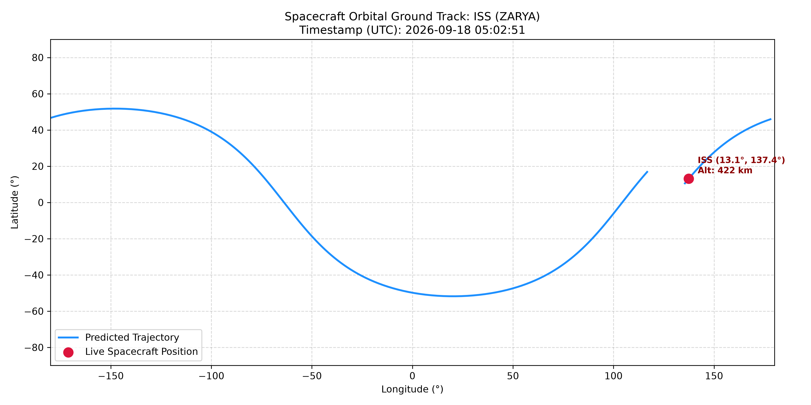

# Real-Time Spacecraft Orbit Propagator & Ground Station Console

A computational astrodynamics toolkit in Python that computes real-time orbital trajectories, Keplerian propagation, and topocentric tracking angles (Azimuth, Elevation, Slant Range) for Low Earth Orbit (LEO) spacecraft.

## Features
- **SGP4 Analytical Propagation**: Computes orbital perturbations (Earth oblateness J2, atmospheric drag) using authoritative NORAD Two-Line Element (TLE) datasets from CelesTrak.
- **Topocentric Look-Angle Computation**: Predicts Acquisition of Signal (AOS), culmination, and Loss of Signal (LOS) relative to an observer ground station.
- **2D Orbit Ground Track**: Projects sub-satellite orbital traces across Mercator maps using `skyfield` and `matplotlib`.
- **Live Mission Telemetry**: Streams instantaneous orbital velocity vectors (~7.66 km/s), altitude, and line-of-sight status in real time.

## Quickstart
```bash
# Install dependencies
pip install --break-system-packages skyfield matplotlib requests numpy

# Run 2D ground track mapping
python3 tracker.py

# Launch real-time telemetry console
python3 flight_station.py
```

## Orbital Ground Track Visualization

